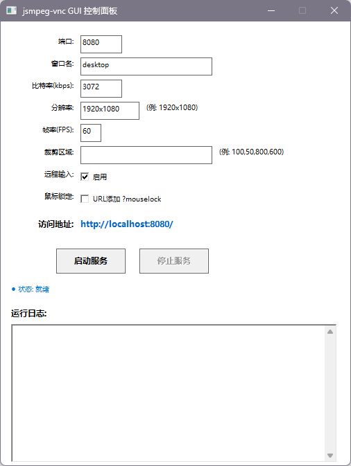

[简体中文](README.md) | [English]
## 🚀 Quick Start
### 1. Prepare Dependencies
Download the latest `jsmpeg-vnc-win.zip` from the [jsmpeg-vnc Official Release Page](https://github.com/phoboslab/jsmpeg-vnc/releases). Extract the files and copy `jsmpeg-vnc.exe` along with its accompanying files into the `Bin` directory mentioned above. (Default bundled version below)
jsmpeg-vnc © Dominic Szablewski (phoboslab)
https://github.com/phoboslab/jsmpeg-vnc
License: GPLv3
Bundled version: v0.2

### 2. Run the GUI
Double-click `jsmpeg-vnc-gui.exe` to launch. Configure the parameters and click "Start":
- **Basic Streaming**: Set Port to `8080`, Window Name to `desktop`. Access via browser at `http://localhost:8080`.
- **Game Streaming (Mouse Lock)**: Check "Add ?mouselock to URL", set Window Name to the game window title. Access at `http://localhost:8080/?mouselock`.
- **Low Bandwidth Adaptation**: Set Bitrate to `1000`, Resolution to `854x480`, FPS to `24`.

### 3. Stop Service
Click the "Stop" button within the GUI, or simply close the GUI window. All resources will be released automatically.

## 🛠️ Build Guide (Visual Studio)
1. Create a new "Windows Desktop Wizard" project → Select "Desktop Application" and "Empty Project".
2. Add the project's `main.cpp` to the project.
3. Project Properties → Advanced → Set Character Set to "Use Unicode Character Set" (keeping the default Multi-Byte is also fine).
4. Compile and build directly; no additional third-party libraries need linking.
> ⚠️ Note during debugging: Visual Studio sets the working directory to the project directory by default. Ensure the `Bin` directory is located in the project root, or modify the "Working Directory" in the debugging properties to `$(TargetDir)`.

## ❓ FAQ
### Q: Browser shows 404 error?
A: Verify if `Bin/client/index.html` exists. If missing, re-download the complete jsmpeg-vnc package.

### Q: Prompt says port is already in use?
A: The GUI attempts to automatically free occupied ports on startup. If the error persists, manually change the port (e.g., to 8081), or wait for the TCP TIME_WAIT state to expire (approx. 1 minute).

### Q: After ending the GUI via Task Manager, `jsmpeg-vnc` is still running?
A: Normally, the Job Object mechanism cleans up child processes automatically. In rare cases where this fails, manually terminate the `jsmpeg-vnc.exe` process. This does not affect subsequent usage.

## 📜 Compliance & License
- **This GUI Project**: Source code is licensed under MIT. You are free to modify, distribute, and use it commercially without being required to open-source your modifications.
- **jsmpeg-vnc Dependency**: © Dominic Szablewski (phoboslab), licensed under [GPLv3](https://www.gnu.org/licenses/gpl-3.0.html). This project invokes jsmpeg-vnc as a separate, independent process and does not constitute a derived work. Therefore, the MIT license and GPLv3 are compatible in this context.
- **Redistribution Requirements**: If you distribute a packaged build containing jsmpeg-vnc, you must retain the jsmpeg-vnc LICENSE file and original author attribution.

## 🙏 Acknowledgments
This project is built upon [jsmpeg-vnc](https://github.com/phoboslab/jsmpeg-vnc) developed by Dominic Szablewski. Thanks for the open-source contribution!

---
If you find this project helpful, please consider giving it a Star⭐!

